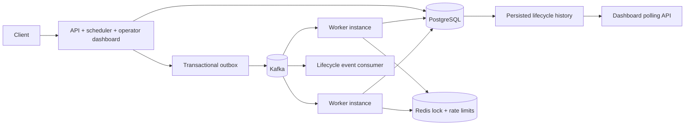
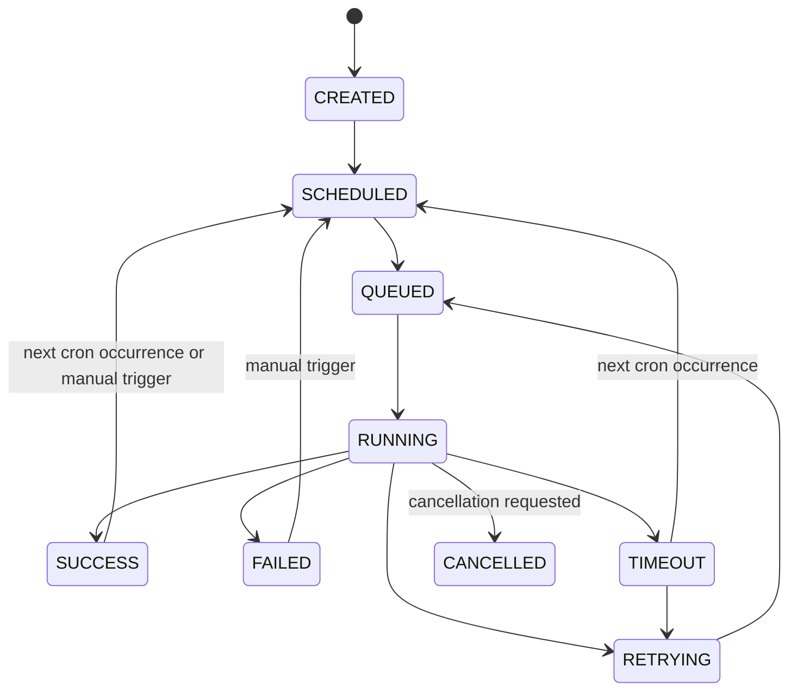

# TaskForge

TaskForge is a Java 21 / Spring Boot distributed job scheduler and execution platform. PostgreSQL is the durable source of truth, Kafka carries at-least-once work and lifecycle events, and Redis supplies expiring coordination locks and API rate limits. The API and worker roles use the same application image.

## Architecture



## Problem and persistence model

TaskForge moves slow or bursty background work out of request-handling servers. API instances accept and schedule work, PostgreSQL records what should happen, Kafka distributes runnable attempts, and worker instances execute them independently. This avoids tying report generation, notifications, reconciliation, backups, ETL, and synchronization to a single application process.

PostgreSQL tables are created by Flyway:

- `users`: credentials, enabled state, and role.
- `jobs`: owner, payload, schedule, next run, current lifecycle state, run number, and retry budget.
- `job_executions`: one durable row per attempt, keyed by job/run/attempt, with worker and lease details.
- `workers`: worker identity, heartbeat, state, and current job.
- `outbox_messages`: Kafka records that must be published after their surrounding database transaction commits.
- `job_events`: persisted lifecycle history used by the dashboard and event topic.
- `admin_audit_log`: actor, target resource, action, request correlation ID, and timestamp for successful admin actions.

`runNumber` identifies a scheduled firing; `attemptNumber` counts retries within that firing. A new cron occurrence gets a fresh retry budget while preserving all earlier executions.

## Job lifecycle



Retries are scheduled in PostgreSQL with an exponential delay. The scheduler claims due rows with `FOR UPDATE SKIP LOCKED`; multiple API instances therefore divide the due set without relying on JVM-local synchronization.

## Kafka and Redis

Kafka topics:

- `taskforge.jobs.execute`: keyed by job ID and consumed by the `taskforge-workers` group.
- `taskforge.jobs.events`: lifecycle events emitted after the matching state and audit rows commit.
- `taskforge.jobs.dlq`: attempts exhausted by permanent failure, retry exhaustion, or worker loss.

Spring Kafka declares these three topics at startup with six partitions by default. Set `TASKFORGE_KAFKA_TOPIC_PARTITIONS` and `TASKFORGE_KAFKA_TOPIC_REPLICATION_FACTOR` to fit the broker cluster; the local single-node Compose setup uses replication factor one.

Malformed, incomplete, or out-of-range execute-topic records (including timeouts over 24 hours) are copied with their original string value to the DLQ before the source offset is acknowledged (a null Kafka value is represented as the literal `null`). Their DLQ records include `taskforge-dlq-reason`, `taskforge-dlq-worker-id`, and `taskforge-dlq-failed-at` headers. A stable key lets downstream consumers recognize duplicate copies. If publishing to the DLQ fails, the source record is nacked and retried instead of discarded.

The API role runs a separate `taskforge-event-notifications` consumer group for lifecycle events. It writes structured log entries; PostgreSQL remains the durable audit source if that consumer is offline.

The outbox relay waits for broker acknowledgement, then marks the row published. A crash between those actions can cause duplicate delivery; database execution claims make repeats of the same execution ID harmless to durable state. Kafka and database state are not a distributed exactly-once transaction.

Redis stores TTL-based worker heartbeats, rate-limit counters, and optional job locks released with a compare-token Lua script. A Redis outage does not block worker claims: PostgreSQL remains authoritative. Rate limiting also fails open during Redis outages so authentication/API availability is preserved.

## Features

- BCrypt registration/login and signed JWT authentication. Public registration always creates `USER`; an initial `ADMIN` can be bootstrapped from environment variables.
- Owner-scoped paginated job APIs, editable unstarted jobs, cancellation requests, manual trigger, status filters, and per-attempt history.
- State transitions guarded by the `Job` domain entity. PostgreSQL `FOR UPDATE SKIP LOCKED` claims due work across scheduler instances.
- A PostgreSQL transactional outbox writes queued state, execution history, and Kafka messages in the same transaction. A separate relay waits for broker acknowledgement, records delivery, and backs off after errors.
- Atomic database worker claims, per-execution lease tokens and bounded expiry, best-effort Redis TTL job locks, worker heartbeats, stale-worker detection, and lease recovery.
- Five- or six-field cron expressions, IANA time zones, and a skip-missed-runs policy: a missed cron occurrence is not replayed; the next future occurrence is calculated after the current run finishes.
- Retryable and permanent failures, configurable capped exponential retry delay, cooperative execution timeouts, durable running-job cancellation requests, and a `taskforge.jobs.dlq` event when retries are exhausted.
- `taskforge.jobs.events` lifecycle events are stored in PostgreSQL, relayed through the outbox, and consumed by a separate notification/logging listener. The operator dashboard polls persisted state every 1.5 seconds and displays jobs, assignments, workers, attempts, and events.
- Dashboard and admin job/worker status totals use grouped database queries, rather than one status-count query per lifecycle state on every refresh.
- Flyway schema migration, Actuator, Prometheus metrics, request IDs, structured log fields, rate limits, OpenAPI/Swagger, and Docker Compose.
- Execution duration is exported as an aggregate timer with no user-controlled labels, keeping Prometheus metric cardinality bounded even when job types are arbitrary strings.

## Run locally

Requirements: Docker Desktop, Java 21+, and Maven 3.9+.

1. Copy `.env.example` to `.env`.
2. Set unique `DB_PASSWORD` and a random `JWT_SECRET` of at least 32 bytes. Set `TASKFORGE_ADMIN_EMAIL` and a unique `TASKFORGE_ADMIN_PASSWORD` (at least 16 characters) if you want the first API startup to create an admin account.
3. Run:

```sh
docker compose up --build
```

Open the dashboard at `http://localhost:8080/`, Swagger at `http://localhost:8080/swagger-ui.html`, and health at `http://localhost:8080/actuator/health`. Scale workers with `docker compose up --build --scale worker=3`.

For a local Maven check, use `mvn test package`. Testcontainers integration tests need a working Docker connection; they are skipped when Docker is unavailable. The app uses Flyway migrations and Hibernate schema validation. For an old local database created by an earlier prototype version, use a disposable database or migrate its data before applying this schema.

## Configuration

| Variable | Purpose |
|---|---|
| `DB_USER`, `DB_PASSWORD` | PostgreSQL Compose credentials; set `DB_PASSWORD` in `.env` |
| `SPRING_DATASOURCE_URL`, `SPRING_DATASOURCE_USERNAME`, `SPRING_DATASOURCE_PASSWORD` | JDBC connection settings |
| `SPRING_DATA_REDIS_HOST` | Redis host |
| `SPRING_KAFKA_BOOTSTRAP_SERVERS` | Kafka bootstrap servers |
| `TASKFORGE_JWT_SECRET` | HMAC signing key, at least 32 bytes |
| `TASKFORGE_ROLE` | `api` runs scheduler/outbox/recovery; `worker` consumes work |
| `TASKFORGE_ADMIN_EMAIL`, `TASKFORGE_ADMIN_PASSWORD` | Optional first-start admin bootstrap; existing accounts are not promoted |
| `TASKFORGE_SCHEDULER_INTERVAL` | Due-job polling interval in milliseconds |
| `TASKFORGE_OUTBOX_INTERVAL` | Outbox relay polling interval in milliseconds |
| `TASKFORGE_OUTBOX_RETENTION_DAYS` | Days to retain Kafka-acknowledged outbox rows before batched pruning; minimum 1, default 14 |
| `TASKFORGE_OUTBOX_RETENTION_INTERVAL` | Delay between outbox retention passes in milliseconds; default 6 hours |
| `TASKFORGE_HEARTBEAT_INTERVAL` | Worker heartbeat interval in milliseconds |
| `TASKFORGE_RECOVERY_INTERVAL` | Lease/dead-worker recovery interval in milliseconds |
| `TASKFORGE_HANDLER_STOP_GRACE_SECONDS` | Seconds to wait after interrupting a handler before recording a terminal no-retry timeout/cancellation; valid range is 1–60 |
| `TASKFORGE_RETRY_BASE_DELAY`, `TASKFORGE_RETRY_MAX_DELAY` | Exponential retry base and cap in seconds |
| `TASKFORGE_KAFKA_TOPIC_PARTITIONS` | Partition count for execute, lifecycle-event, and DLQ topics; default 6 |
| `TASKFORGE_KAFKA_TOPIC_REPLICATION_FACTOR` | Replication factor for those topics; default 1 for the local single-broker stack |
| `TASKFORGE_KAFKA_MAX_POLL_INTERVAL_MS` | Worker consumer poll deadline; default exceeds the maximum 24-hour job timeout |

The `.env` file is ignored by Git. No deployment credentials should be committed.

## API quick start

Register a user:

```http
POST /api/auth/register
Content-Type: application/json

{"email":"dev@example.com","password":"a-long-password"}
```

Use the returned `accessToken` as `Authorization: Bearer <token>`. Create an immediate job:

```http
POST /api/jobs
Authorization: Bearer <token>
Content-Type: application/json

{
  "name":"Daily report",
  "type":"REPORT_GENERATION",
  "payload":{"reportType":"DAILY_SALES"},
  "scheduleType":"IMMEDIATE",
  "priority":"HIGH",
  "maxRetries":3,
  "timeoutSeconds":60
}
```

Main routes:

- Auth: `POST /api/auth/register`, `POST /api/auth/login`
- Jobs: `POST/GET /api/jobs`, `GET/PUT/DELETE /api/jobs/{id}`, `POST /api/jobs/{id}/cancel`, `POST /api/jobs/{id}/trigger`, `GET /api/jobs/{id}/executions`
- Workers (admin only): `GET /api/workers`, `GET /api/workers/{id}`
- Dashboard snapshot: initial `GET /api/dashboard/snapshot?since=<ISO-8601 timestamp>`, then incremental `GET /api/dashboard/snapshot?afterId=<last-event-id>`
- Admin: `GET /api/admin/statistics`, `GET /api/admin/jobs`, `GET /api/admin/workers`, `GET /api/admin/audit`, `POST /api/admin/users/{id}/disable`
- Observability: `/actuator/health`, `/actuator/info`, `/actuator/metrics`, `/actuator/prometheus`

Job types implemented as separate local handler strategies: `REPORT`, `REPORT_GENERATION`, `EMAIL_NOTIFICATION`, `DATA_PROCESSING`, `HTTP_REQUEST`, `DEMO_LONG_RUNNING_TASK`, and `DEMO_FAIL`. These simulate work and validate basic payload shape; the HTTP/email/report handlers do not call external systems yet. Add a `JobHandler` bean to register a new type.

## Delivery, retries, and limits

The scheduler locks due rows with `FOR UPDATE SKIP LOCKED`, then persists the queued job, execution row, and execute-topic outbox record in one PostgreSQL transaction. The relay publishes and waits for Kafka acknowledgement before marking the outbox row delivered. A crash after Kafka acknowledgement but before that database update can publish the same message twice; workers use an atomic execution claim and lease token to prevent a duplicate from changing durable completion state. A scheduled, batched retention task prunes only acknowledged outbox transport rows older than `TASKFORGE_OUTBOX_RETENTION_DAYS` (14 days by default); pending messages and durable job lifecycle history are untouched.

Worker claim, completion, and lease recovery lock the execution row before the job row. Job deletion uses the same order, locking all of that job's executions in ascending ID order before locking the job, so stale queued Kafka records cannot invert the lock order and deadlock deletion against a worker claim.

Lease recovery selects expired executions in `lease_until, id` order using bounded `FOR UPDATE SKIP LOCKED` batches. Multiple API instances can therefore recover different abandoned executions concurrently without waiting on one another's batch locks.

This is **at-least-once** processing, not exactly-once side effects. A process can crash after an external side effect but before completion is committed. Handlers must be idempotent where possible. Workers poll the durable cancellation flag while running and interrupt cooperative handlers; timeout handling also requests interruption. The worker waits for the configured stop grace before recording a result. Local handler execution is bounded to one active task with no queue; if a handler ignores interruption and holds the slot, later Kafka records are nacked before durable claim rather than creating more blocked threads. The affected attempt is marked terminal and is not retried automatically; a CRON job is failed closed rather than starting another occurrence that could overlap the still-running code. The Java thread may remain alive, and an operator must ensure it has stopped before manually triggering the job again. Java cannot forcibly stop arbitrary non-cooperative code. Heartbeats cannot extend a lease past the execution timeout plus a 20-second ceiling, and recovery waits for that lease to expire plus a 10-second safety grace. For untrusted or non-interruptible workloads, use a process/container isolation boundary and terminate that isolated workload at its deadline.

Redis locks have TTLs and compare-token release, but are best-effort coordination aids; workers fall back to PostgreSQL claims if Redis is unavailable. PostgreSQL execution claims and leases are authoritative. Recovery marks the old execution terminal before a retry can be scheduled, so a stale worker cannot overwrite its durable result. The per-claim lease token also fences normal completion. Fencing cannot undo an external side effect already performed by that worker. Cancellation is polled at 250 ms intervals; if cancellation races with successful completion, the attempt is recorded and the job remains cancelled (a cron job is not rescheduled).

Workers process one Kafka record per poll and configure the maximum poll interval above the supported job timeout, avoiding normal long jobs being mistaken for stalled consumers. A worker process crash is still detected by Kafka heartbeats and the independent PostgreSQL execution lease.

Retries use full jitter over an exponential delay, set with `TASKFORGE_RETRY_BASE_DELAY` (default 2 seconds) and `TASKFORGE_RETRY_MAX_DELAY` (default 256 seconds). This same policy applies to handler failures, outbox relay errors, and attempts recovered after a worker lease expires. Jitter spreads retries across workers and relay instances to avoid synchronized retry bursts. `maxRetries=3` means one initial attempt plus up to three retries. Validation/unsupported-type `IllegalArgumentException`s are treated as permanent; other handler exceptions are treated as transient. Exhausted attempts, including crashed attempts recovered after a worker lease expires, emit to the DLQ topic unless the job was cancelled.

## Testing

- Unit and service tests cover lifecycle rules, cron/time-zone calculation, retry backoff, controller validation, ownership checks, worker claim/idempotency behavior, and outbox retry behavior.
- PostgreSQL Testcontainers tests race two scheduler instances and two workers, verify atomic claims and scheduler/outbox persistence, check the lease deadline cap, and recover crashed/cancelled/exhausted attempts.
- PostgreSQL Testcontainers tests verify that outbox retention prunes old acknowledged rows while keeping recent and pending messages.
- A Spring Boot Testcontainers scenario boots PostgreSQL, Redis, and Kafka together, sends an outbox record through a real worker, and verifies duplicate Kafka delivery does not create a second execution.
- Redis and Kafka Testcontainers smoke tests check the infrastructure protocols.
- Testcontainers tests are skipped when Docker is not available; run `mvn test` with Docker running to exercise them.
- `load/taskforge-load.js` provides an optional k6 end-to-end load scenario. Start the Compose stack, create a normal user, then run `k6 run -e TASKFORGE_EMAIL=dev@example.com -e TASKFORGE_PASSWORD=your-password load/taskforge-load.js`. The scenario asserts at least 99% completion, p95 job creation below one second, and p95 end-to-end job completion below 30 seconds. Adjust `JOBS_PER_MINUTE` and `TEST_DURATION` to scale the arrival rate and duration; watch queue depth and worker metrics while the dashboard shows the live flow.

## Design decisions and next improvements

- PostgreSQL remains authoritative; Kafka and Redis do not hold the only copy of job state.
- One modular backend image has explicit `api` and `worker` roles. No service discovery or gateway is needed for this initial deployment shape.
- Compose uses a single-node Kafka broker for local development. It has no broker replication or high availability.
- The container tests are authoritative for database migration and full app wiring; they must run with Docker Desktop running before relying on those deployment paths.
- Dashboard updates use short-interval authenticated polling rather than WebSockets; persisted events make reconnects recoverable.
- Local Compose binds service ports to loopback and runs the application as a non-root user. Compose credentials are development-only and Kafka/Redis are not authenticated; production requires private networking, TLS/authentication, secret management, replicated services, backups, and alerting.
- Admin job mutations are written to `admin_audit_log` in the same transaction as the change and can be inspected through the paginated admin audit endpoint. Entries include actor, target resource, action, timestamp, and request ID when initiated over HTTP.
- Next production hardening: process isolation for arbitrary handlers, chaos/load tests against a multi-node deployment, and a production Kafka/PostgreSQL/Redis security and HA configuration.
