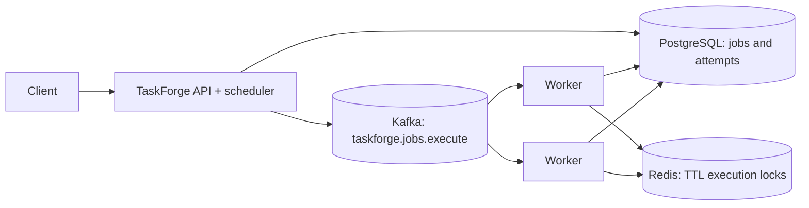

# TaskForge

TaskForge is a Java 21 / Spring Boot reference implementation of a database-backed job scheduler and Kafka worker. PostgreSQL owns durable job and execution state; Kafka distributes work; Redis holds short-lived worker execution locks. The project favors an explainable single deployable application with API and worker roles over unnecessary service-discovery infrastructure.

## Architecture



## Current implementation

- BCrypt registration/login and signed JWT bearer authentication.
- Owner-scoped paginated job listing, detail, create, cancel, and execution history endpoints; `ADMIN` can read all jobs via the same listing route.
- Explicit state transition rules, due-job selection with PostgreSQL pessimistic row locks, attempt history, and retry delay.
- Kafka JSON job delivery and competing worker consumers. Redis `SET NX` locks use a per-delivery random token, TTL, and compare-before-delete Lua release.
- Strategy-style job handlers for report, email, data, HTTP, long-running demo, and forced-failure job types.
- Actuator health/metrics endpoints, springdoc Swagger UI, Docker Compose for PostgreSQL, Redis, Kafka, API, and worker.

## Run locally

Install Docker Desktop, then from this directory run:

```sh
docker compose up --build
```

Open Swagger UI at `http://localhost:8080/swagger-ui.html`; health is at `/actuator/health`. For a local Maven build, use Maven 3.9+ and Java 21: `mvn test` and `mvn package`. No Maven wrapper is included. Compose has local-development fallback credentials for convenience; create a `.env` from `.env.example` and replace both values before sharing or deploying. Never use those fallback values outside local development.

## Configuration

| Variable | Purpose | Local default |
|---|---|---|
| `DB_USER`, `DB_PASSWORD` | PostgreSQL Compose credentials | taskforge / local-dev-only |
| `SPRING_DATASOURCE_URL`, `SPRING_DATASOURCE_USERNAME`, `SPRING_DATASOURCE_PASSWORD` | JDBC configuration | Compose sets these |
| `SPRING_DATA_REDIS_HOST` | Redis hostname | localhost; Compose uses redis |
| `SPRING_KAFKA_BOOTSTRAP_SERVERS` | Kafka brokers | localhost:9092; Compose uses kafka:9092 |
| `TASKFORGE_JWT_SECRET` | HMAC signing key (minimum 32 bytes) | local-only placeholder |
| `TASKFORGE_ROLE` | `api` runs scheduler; `worker` consumes Kafka | api |

## APIs

- `POST /api/auth/register`, `POST /api/auth/login`
- `POST /api/jobs`, `GET /api/jobs?page=0&size=20&sort=createdAt,desc`
- `GET /api/jobs/{id}`, `POST /api/jobs/{id}/cancel`, `GET /api/jobs/{id}/executions`
- `GET /actuator/health`, `/actuator/metrics`; Swagger at `/swagger-ui.html`

Registration accepts `{ "email": "dev@example.com", "password": "a-long-password" }`. Use the returned `accessToken` as `Authorization: Bearer ...`. Job request example:

```json
{
  "name": "Daily report",
  "description": "Generate the daily report",
  "type": "REPORT_GENERATION",
  "payload": {"reportType":"DAILY_SALES"},
  "scheduleType": "IMMEDIATE",
  "priority": "HIGH",
  "maxRetries": 3,
  "timeoutSeconds": 300
}
```

Supported schedule enum values are `IMMEDIATE`, `ONE_TIME`, and `CRON`. `ONE_TIME` accepts `runAt` as an ISO-8601 timestamp; CRON currently requires a cron expression but recurring next-run calculation is not yet implemented. Immediate and due work is dispatched by the scheduler. Job types supported are `REPORT`, `REPORT_GENERATION`, `EMAIL_NOTIFICATION`, `DATA_PROCESSING`, `HTTP_REQUEST`, `DEMO_LONG_RUNNING_TASK`, and `DEMO_FAIL`.

## Data and delivery semantics

`jobs` is the durable source of truth; `job_executions` is per-attempt history with a `(job_id, attempt_number)` uniqueness constraint. The due query orders by priority and time and locks selected rows with `FOR UPDATE`; concurrent scheduler transactions skip contention through row locking, so they do not both claim the same row. This protects database claims across app instances, unlike JVM synchronization.

Kafka processing is at-least-once. A Redis lock limits concurrent execution of a job, and a completed execution status prevents replay from being run again. A crash after performing an external side effect but before persisting success can still cause that side effect to happen again. A lock TTL can expire while a slow worker is still alive. Exactly-once effects require idempotent downstream operations or an application-level idempotency key. The current version sends Kafka work from the scheduler transaction without a transactional outbox, so a database commit and broker publish are not atomic; the outbox pattern is the next production-hardening step.

## Lifecycle and recovery limits

Allowed transitions are centralized in `Job.transition`. Retries are capped by `maxRetries` and use capped exponential delay. Workers expose a forced transient failure demo via `DEMO_FAIL`. The `timeoutSeconds` value bounds the lock TTL but does not yet interrupt or time out handler execution. Cancellation applies to unstarted work; running cancellation is not currently an interrupt protocol. Heartbeat registration, worker inventory, dead-worker recovery, admin statistics/user disable, edit/delete/trigger APIs, request rate limiting, metrics counters, and CRON recurrence computation remain future work. Worker process failures rely on Kafka redelivery and lock expiry; there is no lease-based recovery reconciler yet.

## Design decisions and next steps

- JPA schema update is enabled for a disposable local demo. Use versioned Flyway migrations before production.
- `taskforge.role=api` and `taskforge.role=worker` let the same image run distinct roles. Scale workers with additional Compose replicas or an orchestrator.
- Kafka carries work distribution; PostgreSQL remains authoritative. Redis is coordination only and has expiring keys.
- The single-node Kafka broker is for local development and has no replication/fault tolerance.
- Priorities affect scheduler claim ordering, but Kafka partition ordering and competing consumers do not guarantee strict priority execution.
- Before production: add transactional outbox, a worker lease/heartbeat reconciler, enforce handler timeouts, secure broker and Redis connections, implement migrations, richer admin and schedule APIs, and add Testcontainers integration and concurrency tests.
